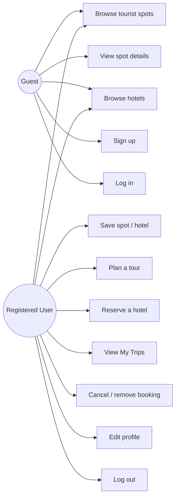
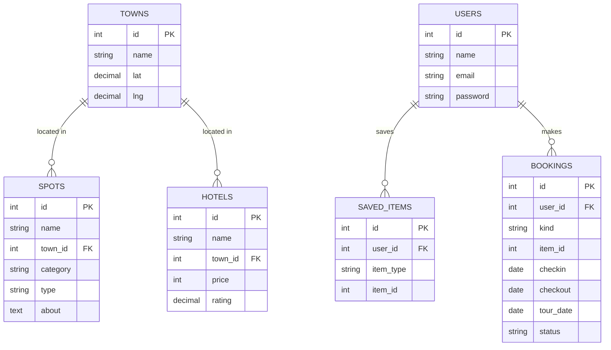

# La Union Tour — Project Documentation

**Course:** COMP-20163 (Web Development)
**Project:** Philippine Tourist Destination Portal
**Destination:** Province of La Union, Philippines

---

## 1. Title Page

**Project Title:** La Union Tour — Online Tour Guide and Booking Portal
**Members:** (group members)
**Instructor:** (instructor)
**School Year / Term:** A.Y. 2025–2026, 2nd Semester

---

## 2. Introduction

La Union is a coastal province in northern Luzon known as the "Surfing Capital of
the North." Tourists often look for information about where to go, what to do, and
where to stay, but that information is usually scattered across many sites.

**La Union Tour** is a database-driven web application that gathers La Union's
tourist spots in one place and lets users plan tours and reserve hotels. It also
suggests nearby places after a booking, similar to how Klook or Agoda recommend
related activities and stays.

---

## 3. Objectives

- Design and develop a responsive web application for a Philippine destination.
- Apply HTML, CSS, JavaScript, PHP, and MySQL together.
- Implement database connectivity and full CRUD (Create, Read, Update, Delete).
- Provide a user-friendly, consistent interface.
- Apply both client-side and server-side validation.
- Implement secure login, sessions, and account management.

---

## 4. Scope and Limitations

**Scope**
- Browsing of 33 tourist spots in 4 categories (beaches & falls, caves & mountains, restaurants, culture & landmarks).
- User registration, login, logout, and profile editing.
- Saving spots/hotels to a personal list.
- Planning tours and reserving hotels, with cancel/remove.
- "Nearby" suggestions computed from real town coordinates (distance).

**Limitations**
- Hotel rates and details are **placeholders**; no real payment is processed.
- No real-time room availability or payment gateway.
- Admin management of spots/hotels is done directly in the database (no admin UI).

---

## 5. System Features

| Feature | Description |
|---------|-------------|
| Tourist spot catalog | Spots grouped by category, with a detail view (location, price, hours, contact). |
| Search-free browsing | Category sections with photos for beaches and color placeholders elsewhere. |
| Authentication | Sign up, log in, log out using PHP sessions and hashed passwords. |
| Password rules | Min 8 chars, upper, lower, number — shown as a live checklist, plus confirm-password. |
| Save / favourites | Heart button on cards; a count badge appears in the navigation. |
| Plan a tour | Pick a date and number of people for a spot. |
| Reserve a hotel | Pick check-in/out and guests; total is computed from nights × nightly rate. |
| Nearby suggestions | After booking, the app lists the closest hotels (for a spot) or spots (for a hotel). |
| My Trips | View bookings and saved items; open a booking for traveller tips; cancel/remove. |
| Profile editing | Update name, email, and password. |

---

## 6. Use Case Diagram

Guests can browse and must register/log in to save, book, or manage trips.

---

## 7. Entity Relationship Diagram (ERD)

**Relationships**
- A town has many spots and many hotels (`spots.town_id`, `hotels.town_id` → `towns.id`).
- A user has many saved items and many bookings (`saved_items.user_id`, `bookings.user_id` → `users.id`, `ON DELETE CASCADE`).

---

## 8. Data Dictionary

**towns**

| Column | Type | Notes |
|--------|------|-------|
| id | INT, PK, AUTO_INCREMENT | town id |
| name | VARCHAR(80), UNIQUE | town name |
| lat | DECIMAL(8,4) | latitude (for distance) |
| lng | DECIMAL(8,4) | longitude (for distance) |

**users**

| Column | Type | Notes |
|--------|------|-------|
| id | INT, PK, AUTO_INCREMENT | user id |
| name | VARCHAR(120) | full name |
| email | VARCHAR(160), UNIQUE | login email |
| password | VARCHAR(255) | bcrypt hash |
| created_at | DATETIME | defaults to now |

**spots**

| Column | Type | Notes |
|--------|------|-------|
| id | INT, PK | spot id |
| name | VARCHAR(160) | spot name |
| town_id | INT, FK → towns.id | location |
| category | VARCHAR(40) | beaches / mountains / food / culture |
| type | VARCHAR(60) | e.g. Beach, Waterfall, Museum |
| about | TEXT | description |
| location | VARCHAR(255) | full address |
| price | VARCHAR(60) | entrance/price range or "Free" |
| hours | VARCHAR(60) | operating hours |
| phone | VARCHAR(60) | contact number |
| email | VARCHAR(160) | contact email |
| image | VARCHAR(255) | image path (beaches only) |

**hotels**

| Column | Type | Notes |
|--------|------|-------|
| id | INT, PK | hotel id |
| name | VARCHAR(160) | hotel name |
| town_id | INT, FK → towns.id | location |
| type | VARCHAR(60) | e.g. Resort, Hostel, Inn |
| price | INT | nightly rate (placeholder) |
| rating | DECIMAL(2,1) | star rating |
| about | TEXT | description |
| amenities | VARCHAR(255) | comma-separated amenities |
| image | VARCHAR(255) | image path |

**saved_items**

| Column | Type | Notes |
|--------|------|-------|
| id | INT, PK | row id |
| user_id | INT, FK → users.id | owner |
| item_type | ENUM('spot','hotel') | what was saved |
| item_id | INT | spot id or hotel id |
| created_at | DATETIME | defaults to now |
| | UNIQUE(user_id, item_type, item_id) | prevents duplicates |

**bookings**

| Column | Type | Notes |
|--------|------|-------|
| id | INT, PK | booking id |
| user_id | INT, FK → users.id | owner |
| kind | ENUM('hotel','tour') | booking type |
| item_id | INT | hotel id or spot id |
| item_name | VARCHAR(160) | name at time of booking |
| town | VARCHAR(80) | town name |
| checkin / checkout | DATE | hotel dates |
| guests | INT | hotel guests |
| tour_date | DATE | tour date |
| people | INT | tour people |
| total | INT | hotel total (nights × rate) |
| status | ENUM('confirmed','cancelled') | booking status |
| created_at | DATETIME | defaults to now |

---

## 9. Database Design

The database is normalized: location data is kept once in `towns` and referenced
by `spots` and `hotels` through foreign keys, avoiding repeated town/coordinate
data. User-owned data (`saved_items`, `bookings`) references `users` with
`ON DELETE CASCADE` so a deleted user's records are cleaned up. All tables use
the InnoDB engine to enforce foreign keys. The full schema and seed data are in
[`sql/setup.sql`](sql/setup.sql).

---

## 10. Interface Design

- **Landing page** — video/branded hero, a short history of La Union, the spot
  catalog by category, and a "Where to Stay" hotel teaser.
- **Hotels page** — hotel cards with rating and nightly rate; reservation modal.
- **My Trips** — tabs for Bookings and Saved; bookings open a detail modal with
  "what to bring" and "good to know" tips.
- **Auth pages** — login, sign up (live password checklist + confirm), profile.
- Colors follow the La Union / Philippine flag palette (red, royal blue, gold,
  white). Layout is responsive and mobile-friendly (hamburger menu, fluid grids).

---

## 11. Testing Results

| # | Test | Steps | Expected | Result |
|---|------|-------|----------|--------|
| 1 | Sign up validation | Submit weak password | Rejected with specific message | Pass |
| 2 | Confirm password | Mismatch on sign up | "Passwords do not match" | Pass |
| 3 | Duplicate email | Sign up with existing email | "Email already registered" | Pass |
| 4 | Login | Correct / wrong credentials | Success / "Wrong email or password" | Pass |
| 5 | Save (Create/Delete) | Toggle heart on a card | Item added/removed; badge updates | Pass |
| 6 | Plan tour | Pick date + people | Booking created; nearby hotels shown | Pass |
| 7 | Past date | Tour/hotel date in the past | Server rejects | Pass |
| 8 | Reserve hotel | Pick dates + guests | Total = nights × rate; nearby spots shown | Pass |
| 9 | Read bookings | Open My Trips | Bookings and saved items listed | Pass |
| 10 | Update | Edit profile / cancel booking | Changes saved | Pass |
| 11 | Delete | Remove a cancelled booking | Booking removed | Pass |
| 12 | Auth guard | Open My Trips logged out | Redirected to login | Pass |
| 13 | Responsive | Resize to mobile width | Menu collapses, grid reflows | Pass |

> The PHP layer (page serving, routing, PDO connection handling, static assets,
> and graceful error when the database is missing) was verified with the PHP
> built-in server. CRUD flows were tested after importing `sql/setup.sql`.

---

## 12. Conclusion

The project meets the requirements of a dynamic, database-driven tourism portal.
It integrates a responsive front end (HTML, CSS, JavaScript) with a PHP back end
and a normalized MySQL database, and demonstrates full CRUD, session-based
authentication, and both client- and server-side validation. Building it taught
us how to connect the front end to a relational database through PHP, validate
input on both sides, and keep a consistent, user-friendly interface.

---

## 13. References

- La Union Provincial Tourism information (public listings).
- PHP Manual — PDO and sessions (php.net).
- MySQL 8.0 Reference Manual (dev.mysql.com).
- MDN Web Docs — HTML, CSS, JavaScript, Fetch API (developer.mozilla.org).
