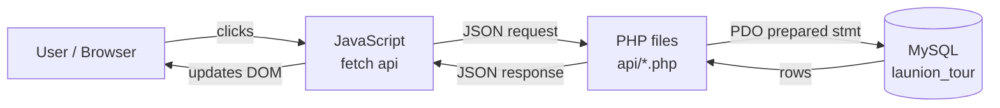

# ELYUNA — Reviewer & Syntax Cheatsheet

A study guide for **defending and presenting** the project. It explains how the
website is wired together (with a plain-English analogy), then gives a quick
syntax refresher for every language we used — with snippets taken straight from
our own code so they look familiar.

---

## 1. The 10-second pitch

> **ELYUNA** is a database-driven tour-and-hotel portal for La Union. The browser
> shows the pages (HTML/CSS/JS), JavaScript asks our PHP files for data, PHP talks
> to a MySQL database, and the answer travels back as **JSON** that JavaScript
> turns into what you see on screen. After a booking it suggests nearby places by
> comparing town coordinates.

Tech stack: **HTML5 + CSS3 + JavaScript** (front end) · **PHP 8** (back end) ·
**MySQL 8** (database) · **PDO** (the safe bridge between PHP and MySQL).

---

## 2. The restaurant analogy (how it's all connected)

Think of the website as a **restaurant**:

| Restaurant | Our project | What it does |
|------------|-------------|--------------|
| The customer | **The browser / user** | Asks for things, sees the result |
| Dining room & menu | **HTML + CSS** (`index.html`, `style.css`) | The layout and looks |
| The waiter | **JavaScript `fetch`** (`api()` in `app.js`) | Takes your order to the kitchen, brings food back |
| The order slip | **JSON request** | A written, structured order |
| The kitchen staff | **PHP files** (`api/*.php`) | Reads the order, prepares it, follows rules |
| The pantry / storage | **MySQL database** | Where all the ingredients (data) are kept |
| The serving window with hygiene rules | **PDO + prepared statements** | The only way to reach the pantry; keeps things safe |
| The finished dish | **JSON response** | Structured data sent back to the waiter |

**The golden rule:** the customer (browser) **never** walks into the pantry
(database) directly. Every request goes *through the waiter (JS) to the kitchen
(PHP) to the pantry (MySQL)* and back. That separation is what keeps the data
safe and the code organized.

---

## 3. How a request actually flows (concrete example)

**Scenario: a logged-in user reserves a hotel.**

```
1. USER clicks "Reserve now"            (hotels.html — a button)
2. JS gathers the dates + guests and calls:
      api("api/book-hotel.php", "POST", { hotelId, checkin, checkout, guests })
                                          (js/hotels.js -> reserveHotel)
3. fetch() sends a JSON request over HTTP to the PHP file
4. book-hotel.php:
      - require_login()           checks the session (are you logged in?)
      - validates the dates       (not in the past, checkout after checkin)
      - INSERT the booking         (PDO prepared statement -> MySQL)
      - asks nearby_spots()        (MySQL: all spots + towns, ranked by distance)
5. PHP replies with JSON:
      { ok, bookingId, nights, total, suggestions }
6. JS reads the JSON and updates the page:
      - shows "Reservation confirmed" + booking reference
      - renders the "You might also like" nearby spots
```

No page reload happens — JavaScript swaps the content in place. This is the
**dynamic, database-driven** behavior the project is graded on.

### The layers, drawn out



---

## 4. File-by-file map (what to point at during the demo)

**Pages (HTML)**
- `index.html` — landing page: hero video, La Union history, spot catalog, hotel teaser.
- `hotels.html` — hotel list + reservation modal.
- `login.html` / `signup.html` / `profile.html` — accounts.
- `trips.html` — "My Trips": bookings + saved items.

**JavaScript**
- `js/app.js` — **shared** helpers: the `api()` fetch wrapper, login state, nav,
  search box, hearts (save), toasts, the detail modal.
- `js/index.js` — builds the spot catalog on the landing page.
- `js/hotels.js` — hotel cards, reservation modal, nearby-spot suggestions.
- `js/trips.js` — renders bookings and saved items.

**PHP API (`api/`)** — each file does one job and returns JSON:
| File | Job |
|------|-----|
| `db.php` | Opens the PDO connection + shared helpers (`json_out`, `require_login`, `distance_km`, `nearby_spots`, `nearby_hotels`). Every API includes this first. |
| `signup.php` / `login.php` / `logout.php` / `me.php` | Accounts + session. |
| `profile.php` | Update name / email / password. |
| `spots.php` / `hotels.php` | List spots / hotels. |
| `suggestions.php` | Nearby spots for a hotel, or nearby hotels for a spot. |
| `saved.php` | Save list — GET (read), POST (add), DELETE (remove). |
| `book-tour.php` / `book-hotel.php` | Create a booking. |
| `bookings.php` / `cancel-booking.php` / `delete-booking.php` | Read / update / delete bookings. |

**Database (`sql/`)**
- `setup.sql` — creates the DB, the app user, all tables, and seed data (run once).
- `update-images.sql` — re-applies spot photos + the hotel list to an existing DB
  *without* wiping users/bookings.
- `_gen.js` — the generator. **Edit data here, then run `node sql/_gen.js`** to
  rewrite both SQL files so they always match.

---

## 5. Syntax cheatsheet (with our own code)

### HTML — structure & semantics
```html
<article class="card" data-id="3" role="button">   <!-- data-* carries the id -->
  
  <h4>The Salt Boutique Hotel</h4>
</article>
```
- `data-id` stores a value JS reads later via `element.dataset.id`.
- `alt`, `aria-label`, `role` = accessibility (good marks for usability).

### CSS — variables + responsive
```css
:root { --blue:#0038a8; --red:#ce1126; --gold:#fcd116; }  /* flag palette */
.grid { display:grid; grid-template-columns:repeat(3,1fr); gap:20px; }
@media (max-width:760px){ .grid{ grid-template-columns:1fr; } } /* mobile */
```
- **CSS variables** (`--blue`) keep colors consistent and easy to change.
- **`@media`** query = the page reflows on small screens (hamburger menu, 1 column).

### JavaScript — the patterns we use everywhere
```js
// 1) ONE wrapper around fetch (app.js) — used by every page
async function api(url, method, body) {
  const options = { method: method || "GET", headers:{ "Content-Type":"application/json" } };
  if (body) options.body = JSON.stringify(body);   // JS object -> JSON text
  const res = await fetch(url, options);
  return { ok: res.ok, status: res.status, data: await res.json() }; // JSON -> JS object
}

// 2) Calling it (await = wait for the server before continuing)
const res = await api("api/hotels.php");
HOTELS = res.data.hotels;

// 3) Build HTML from data and put it on the page
grid.innerHTML = HOTELS.map(hotelCard).join("");

// 4) React to clicks
button.addEventListener("click", function () { openHotelModal(id); });
```
Key terms to know: **`async/await`** (handle a slow network call without freezing
the page), **`fetch`** (the actual HTTP request), **`JSON.stringify` / `res.json()`**
(convert between JS objects and text), **`addEventListener`** (run code on a click),
**`innerHTML` / `dataset`** (read/write the page).

### PHP — back-end essentials
```php
// Connect once, safely (db.php)
$pdo = new PDO("mysql:host=127.0.0.1;dbname=launion_tour;charset=utf8mb4",
               $DB_USER, $DB_PASS, [PDO::ATTR_ERRMODE => PDO::ERRMODE_EXCEPTION]);

// Read the JSON the browser sent
$data = body();                       // helper that json_decode()s the request
$email = strtolower(trim($data["email"] ?? ""));

// PREPARED STATEMENT — the ? is filled safely (blocks SQL injection)
$stmt = $pdo->prepare("SELECT id, password FROM users WHERE email = ?");
$stmt->execute([$email]);
$user = $stmt->fetch();

// Passwords are HASHED, never stored as plain text
$hash = password_hash($password, PASSWORD_DEFAULT);   // on sign up
password_verify($password, $user["password"]);        // on login

// Sessions remember who is logged in across requests
$_SESSION["user_id"] = $id;

// Always answer in JSON
json_out(["user" => ["id" => $id, "name" => $name]]);
```

### SQL / MySQL — schema + the queries we run
```sql
-- A table with a FOREIGN KEY (spots belong to a town)
CREATE TABLE spots (
  id INT AUTO_INCREMENT PRIMARY KEY,
  name VARCHAR(160) NOT NULL,
  town_id INT NOT NULL,
  CONSTRAINT fk_spot_town FOREIGN KEY (town_id) REFERENCES towns(id)
) ENGINE=InnoDB;

-- JOIN = combine hotels with their town's name + coordinates
SELECT h.name, t.name AS town, t.lat, t.lng
FROM hotels h JOIN towns t ON h.town_id = t.id;

-- The four CRUD verbs we demonstrate:
INSERT INTO bookings (...) VALUES (...);   -- Create
SELECT ... FROM bookings WHERE user_id=?;  -- Read
UPDATE bookings SET status='cancelled' ...;-- Update
DELETE FROM saved_items WHERE ...;         -- Delete
```

---

## 6. The "nearby suggestions" feature (a likely question)

There is **no hardcoded list** of which spots are near which hotel. Instead we
store each town's **latitude/longitude** once, and compute distance on the fly
with the **haversine formula** (`distance_km()` in `db.php`):

1. Look up the hotel's town coordinates.
2. Measure the distance to every spot's town.
3. Sort by closeness and return the nearest 4.

```php
function nearby_spots($pdo, $lat, $lng, $limit = 4) {
  $rows = $pdo->query("SELECT s.*, t.lat, t.lng FROM spots s JOIN towns t ...")->fetchAll();
  return rank_by_distance($rows, $lat, $lng, $limit);  // sort by distance_km, slice top 4
}
```

Because it's distance-based, hotels in the **same town give the same suggestions**
(e.g. all San Juan hotels → Urbiztondo Beach + Gefseis Greek Grill), and a hotel
in **Bauang** suggests Bauang spots (Gapuz Grapes Farm), **Sudipen** suggests
Sudipen spots, and so on. This is why each hotel's **town** must be correct.

---

## 7. Database normalization (UNF to 3NF) — how the schema was designed

We did not start with six tables. We started with one flat record of everything a
trip involves, then **normalized** it step by step to remove repeated data and
update problems. This is the process to walk through if the panel asks how you
designed the database.

**Definitions to memorize:**
- **1NF** — every field holds one value, no repeating groups, each row has a key.
- **2NF** — 1NF, and every non-key column depends on the **whole** key, not just part of it (no partial dependency).
- **3NF** — 2NF, and no non-key column depends on **another non-key column** (no transitive dependency).

### Step 0 — UNF (one unnormalized sheet)

Picture recording each user's trips on a single sheet: one row per user, with
repeating groups (a user has many bookings and many saved places) and a
multi-valued field (a hotel's amenities).

```
TRIP_SHEET ( user_id, name, email,
  bookings { kind, place_name, place_town, town_lat, town_lng, amenities,
             checkin, checkout, guests, total, status },
  saved    { place_type, place_name } )
```

Problem: the repeating groups and the multi-valued `amenities` cannot sit in one
clean relational table.

### Step 1 — 1NF (atomic values, no repeating groups)

Give each repeating group its own rows, make every cell a single value, and pick a key.

```
BOOKING_1NF ( booking_id PK, user_id, name, email,
              place_id, place_name, place_town, town_lat, town_lng, amenities,
              checkin, checkout, guests, total, status )
SAVED_1NF   ( user_id, place_type, place_id )      -- key = all three columns
```

Flat now, but each booking row repeats the user's name and email, and repeats the
town and its coordinates for every place.

### Step 2 — 2NF (remove partial dependencies)

A reservation line is identified by who booked what, the pair `(user_id, place_id)`.
Some columns depend on only **part** of that key:

- `name`, `email` depend on `user_id` alone, so they move to **USERS**.
- `place_name`, `place_town`, `town_lat`, `town_lng`, `amenities` depend on `place_id` alone, so they move to **SPOTS** and **HOTELS**.
- `checkin`, `checkout`, `guests`, `total`, `status` depend on the whole reservation, so they stay in **BOOKINGS** (with a surrogate `booking_id`, since a user can book the same place again on other dates).

```
USERS    ( id PK, name, email, password )
HOTELS   ( id PK, place_name, town, town_lat, town_lng, type, price, rating, amenities )
BOOKINGS ( id PK, user_id FK, item_id, checkin, checkout, guests, total, status )
SAVED_ITEMS ( id PK, user_id FK, item_type, item_id )
```

Each user is now stored once.

### Step 3 — 3NF (remove transitive dependencies)

Inside HOTELS (and SPOTS) a non-key column still depends on another non-key column:
`town_lat` and `town_lng` depend on the **town**, not on the place id. That chain,
`place_id` to `town` to `(lat, lng)`, is a transitive dependency.

Fix: pull the town and its coordinates into their own table, referenced by a foreign key.

```
TOWNS  ( id PK, name, lat, lng )
SPOTS  ( id PK, name, town_id FK, category, type, about, location, price, hours, phone, email, image )
HOTELS ( id PK, name, town_id FK, type, price, rating, about, amenities, image )
```

Each town and its coordinates are stored once. Updating a coordinate is a single
change, and the nearby-suggestion feature reads those coordinates from one place.

### Final design in 3NF — the six tables

`towns`, `users`, `spots`, `hotels`, `saved_items`, `bookings`. Every fact lives
once, and the foreign keys hold it together (`spots.town_id`, `hotels.town_id` to
`towns.id`; `saved_items.user_id`, `bookings.user_id` to `users.id`).

### Two honest notes, in case the panel pushes

- **amenities** is kept as one comma-separated text field in `hotels`, used only for
  display. A stricter design would split it into an `amenities` table plus a
  hotel-amenities link table. We judged that unnecessary for a read-only label and
  chose the simpler field. Say this plainly if asked.
- **bookings** keep `item_name` and `town` as a snapshot taken at booking time, on
  purpose, so a past booking still reads correctly even if the place is edited later.

---

## 8. Things to be ready to explain (defense prep)

- **Why a database (not just files)?** Data is structured, queryable, and
  normalized — town info is stored once and reused by spots and hotels via
  foreign keys, so there's no repetition.
- **Client-side vs server-side validation.** The password checklist in the browser
  is for *convenience*; PHP re-checks everything (`password_problems`, past-date
  checks) because the browser can be bypassed. **Never trust the client.**
- **Why prepared statements?** The `?` placeholders stop **SQL injection** — user
  input can never be run as SQL.
- **How are passwords kept safe?** `password_hash()` (bcrypt) — we store the hash,
  not the password; `password_verify()` checks it at login.
- **How does the site know I'm logged in?** PHP **sessions** (`$_SESSION`); pages
  that need a login call `require_login()` and return 401 if you're not.
- **What is JSON and why use it?** A lightweight text format both PHP and JS
  understand — it's the common language between the back end and front end.
- **What does CRUD map to?** Save/book = **Create**, lists = **Read**, profile edit
  / cancel = **Update**, remove saved / delete booking = **Delete**.

---

## 9. Real-world extensions (what a production system would add)

Our app covers the full booking lifecycle for the project's scope. A live
commercial site would go further with:

- **Payment gateway** — collect and verify payment (GCash, card) before
  confirming. *(Intentionally out of scope for this project.)*
- **Real-time room availability / inventory** — track how many rooms each hotel
  has per night and block sold-out dates. We assume rooms are always available.
- **Email / SMS confirmation** — automatically send the booking reference to the guest.
- **Reschedule / modify a booking** — change dates or guests in place (right now
  the user cancels and re-books).
- **Admin dashboard** — staff manage hotels, spots, and reservations through a UI
  instead of editing the database directly.

What we **do** guard against already: past dates, check-out before check-in, and
**double-booking the same hotel on overlapping dates** (and the same tour twice on
one date). Being able to name these trade-offs shows the difference between a
class prototype and production software.

---

## 10. One-line summary to memorize

> **Browser shows it → JavaScript fetches it → PHP prepares it → MySQL stores it,
> and JSON carries the message back and forth.**
